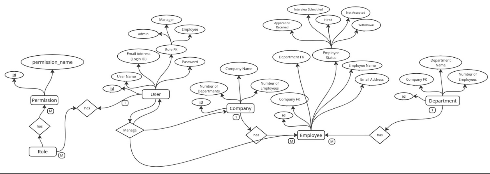
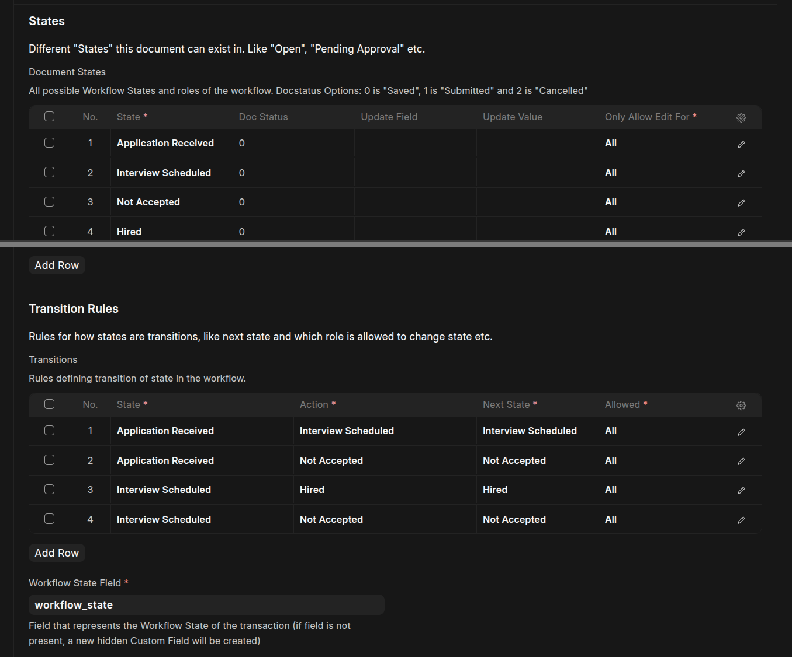
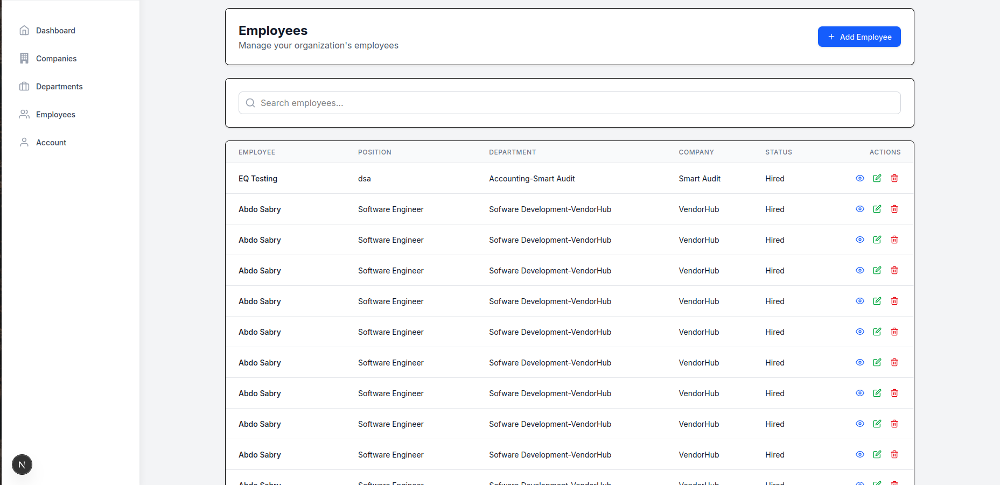

# Employee App

[](./license.txt)
[](https://github.com/MostafaKadry/frappe-employee-app/actions/workflows/ci.yml)
[](https://pre-commit.com/)

A modern, modular, and extensible Employee Management App built on [Frappe Framework](https://frappeframework.com/). Manage employees, departments, and companies with robust reporting, permissions, and developer-friendly practices.

---

## 🚀 Features
- **Employee Management**: Create, update, and organize employee records.
- **Department & Company Modules**: Structure your organization for efficient management.
- **Reporting**: Built-in employee reports for insights and analytics.
- **Permissions & Security**: Fine-grained access control for sensitive data.
- **APIs**: Easily access department and employee data programmatically.
- **Extensible**: Designed to be customized and expanded for your needs.

---

## 🔗 Project Links

- **Production Instance:** [employee-app-opal.vercel.app](https://employee-app-opal.vercel.app/) for sorry server subscription ended.
- **Frontend Repo:** [employee-app (frontend)](https://github.com/MostafaKadry/employee-app.git)

---

## 📦 Installation

You can install this app using the [bench](https://github.com/frappe/bench) CLI:

```bash
cd $PATH_TO_YOUR_BENCH
bench get-app https://github.com/MostafaKadry/frappe-employee-app --branch develop
bench install-app employee_app
```

For more details, see [Frappe App Installation Guide](https://frappeframework.com/docs/user/en/installation).

---

## 📚 Usage

After installation, access modules via Frappe Desk:

- **Employee**: Add/edit/view employees.
- **Department**: Organize employees by department.
- **Company**: Manage company entities.
- **Reports**: Generate employee reports.

---

## 🖼️ Screenshots


**Employee App Databse ERD**


**Client Side Dashboard**


**Employee Wrokflow**



**Employee Report using NextJs code**


**Company Dashboard**


---

## 🌐 Demo

Want to see it in action?  
👉 **[Try the Employee App Live](https://employee-app-opal.vercel.app/)**

---

## ❓ FAQ

>
> **Q: Is the frontend open-source?**  
> **A:** Yes! [employee-app frontend repo](https://github.com/MostafaKadry/employee-app.git)

---

## 🧑‍💻 Support

- **Issues & Bugs**: [GitHub Issues](https://github.com/MostafaKadry/frappe-employee-app/issues)
- **Discussions/Questions**: [GitHub Discussions](https://github.com/MostafaKadry/frappe-employee-app/discussions)
- **Email**: mostafakadry806@gmail.com

---

## 📅 Roadmap
- what done ?
- [] Build Backend Modules
- [] Create a RESTful API that supports all CRUD operations for all models
- [] Automatically calculate the number of departments and employees in the company
- [] Automatically calculate the number of employees in the department
- [] Automatically calculate the number of days an employee has been with the company based on the hiring date using Cron Job Hooks
- [] Handle cascading deletions
- [] Workflow, Developed a workflow to model the onboarding process for new employees
- [] Used Read Frappe User Module to Implement role-based access control.
- [] Ensure that authentication and authorization is always handled throughout user activity
- [] 
- what not done yet?
- [ ] Add RESTful API documentation
- [ ] DB Queries Pagination
- [ ] integrate workflow actions with frontend
- [ ] Include unit tests
- [ ] Include integration tests

---


## 🙏 Acknowledgements

- Powered by [Frappe Framework](https://frappeframework.com/)

